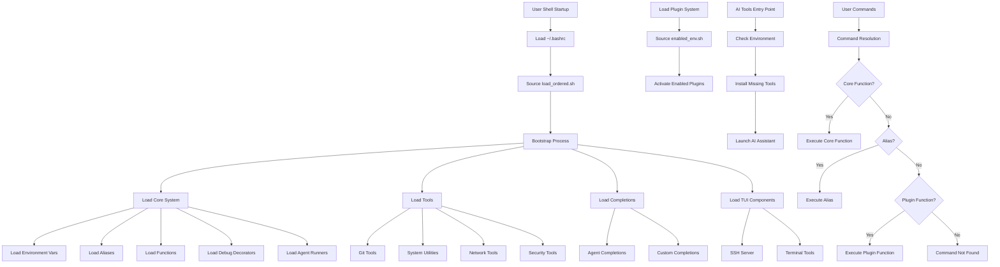

# bash_functions.d - Comprehensive Workflow Analysis & Organization Plan

## Executive Summary

This document provides a detailed analysis of the bash_functions.d ecosystem, including workflow diagrams, logical architecture, and pseudo code to explain the system's operation and organization.

## 🏗️ System Architecture Overview

### Core Components

```
bash_functions.d/
├── 🏃 BOOTSTRAP LAYER     # Initial loading and dependency resolution
├── 🔧 CORE SYSTEM         # Core utilities, aliases, and functions
├── 🛠️ TOOLS ECOSYSTEM     # Specialized tools and utilities
├── 🤖 AI CODING TOOLS     # AI assistant management
├── 🔌 PLUGIN SYSTEM       # Extensible plugin architecture
├── 📚 DOCUMENTATION       # Help system and documentation
├── 🧪 TESTING FRAMEWORK   # Validation and testing
└── 🎯 USER INTERFACE      # Terminal UI and CLI tools
```

## 🔄 Main Workflow Diagram



## 🎯 Core Loading System Logic

### Pseudo Code: Main Loading Process

```pseudo
FUNCTION main_bootstrap():
    SET basedir = dirname(BASH_SOURCE[0])
    SET load_dirs = [
        "core",
        "core/agents", 
        "tools",
        "completions", 
        "tui"
    ]
    
    FOR each dir IN load_dirs:
        IF directory exists basedir/dir:
            FOR each file IN dir/*.sh:
                IF file exists:
                    source(file)
    
    // Load specific core files
    IF file exists basedir/core/aliases.sh:
        source(basedir/core/aliases.sh)
    
    IF file exists basedir/core/functions.sh:
        source(basedir/core/functions.sh)
        
    IF file exists basedir/core/debug_decorators.sh:
        source(basedir/core/debug_decorators.sh)
    
    // Load enabled plugins
    enabled_env = basedir/plugins/enabled_env.sh
    IF file exists enabled_env:
        source(enabled_env)
        
    RETURN SUCCESS

FUNCTION plugin_activation():
    // Regenerate enabled environment
    CALL regenerate_enabled_env()
    
    // Prepend plugin bins to PATH
    FOR each plugin IN enabled_plugins:
        plugin_bin = plugins_dir + "/" + plugin + "/bin"
        IF directory exists plugin_bin:
            PREPEND plugin_bin TO PATH
    
    // Source plugin init scripts
    FOR each plugin IN enabled_plugins:
        init_script = plugins_dir + "/" + plugin + "/init.sh"
        IF file exists init_script:
            source(init_script)
```

## 🤖 AI Tools System Logic

### Pseudo Code: AI Tools Management

```pseudo
FUNCTION ai_tools_entry():
    // Check if in AI tools directory
    IF current_directory contains "ai_coding_tools":
        // Setup environment using direnv
        SETUP_direnv_nvm_environment()
        
        // Check tool availability
        FOR each ai_tool IN available_tools:
            IF NOT command_exists(ai_tool.command):
                INSTALL_ai_tool(ai_tool)
    
    RETURN available_tools

FUNCTION ai_tool_installer():
    FUNCTION install_tool(tool_name):
        IF command_exists(tool_name):
            RETURN SUCCESS // Already installed
            
        SET installer_func = get_installer_function(tool_name)
        IF installer_func exists:
            CALL installer_func()
            RETURN SUCCESS
        ELSE:
            RETURN ERROR // No installer available
            
    FUNCTION install_all_tools():
        FOR each tool IN tool_manifest:
            IF NOT command_exists(tool.command):
                CALL install_tool(tool.name)
                
    FUNCTION check_installation_status():
        FOR each tool IN tool_manifest:
            status = command_exists(tool.command) ? "INSTALLED" : "MISSING"
            PRINT tool.name + ": " + status
```

## 🔌 Plugin System Logic

### Pseudo Code: Plugin Management

```pseudo
FUNCTION plugin_manager():
    FUNCTION install_plugin(plugin_name, git_url):
        CLONE git_url TO plugins_dir + "/" + plugin_name
        PRINT "Installed " + plugin_name
        
    FUNCTION enable_plugin(plugin_name):
        CREATE symlink plugins_dir/enabled/plugin_name -> plugins_dir/plugin_name
        CALL register_plugin_bin(plugin_name)
        CALL regenerate_enabled_env()
        PRINT "Enabled " + plugin_name
        
    FUNCTION disable_plugin(plugin_name):
        REMOVE symlink plugins_dir/enabled/plugin_name
        CALL unregister_plugin_bin(plugin_name)
        CALL regenerate_enabled_env()
        PRINT "Disabled " + plugin_name
        
    FUNCTION regenerate_enabled_env():
        CREATE temp_file
        WRITE "# Auto-generated plugin environment" TO temp_file
        
        // Add PATH prepends for plugin bins
        FOR each enabled_plugin:
            plugin_bin = plugins_dir + "/" + plugin_name + "/bin"
            IF directory exists plugin_bin:
                WRITE "PATH=\"" + plugin_bin + ":$PATH\"" TO temp_file
        
        // Add source lines for init scripts
        FOR each enabled_plugin:
            init_script = plugins_dir + "/" + plugin_name + "/init.sh"
            IF file exists init_script:
                WRITE "source \"" + init_script + "\"" TO temp_file
        
        MOVE temp_file TO enabled_env_path
        CHMOD 644 enabled_env_path
```

## 🧪 Testing Framework Logic

### Pseudo Code: Validation System

```pseudo
FUNCTION validate_system():
    // Validate core files exist
    REQUIRED_FILES = [
        "core/load_ordered.sh",
        "core/aliases.sh", 
        "core/functions.sh",
        "tools/validate_system.sh"
    ]
    
    FOR each file IN REQUIRED_FILES:
        IF NOT file_exists(file):
            PRINT "ERROR: Missing required file: " + file
            RETURN ERROR
    
    // Check tool installations
    REQUIRED_TOOLS = ["git", "curl", "jq"]
    FOR each tool IN REQUIRED_TOOLS:
        IF NOT command_exists(tool):
            PRINT "WARNING: Tool not found: " + tool
    
    RETURN SUCCESS

FUNCTION autocorrect_system():
    // Fix common issues
    FOR each issue IN detected_issues:
        SWITCH issue.type:
            CASE "missing_tool":
                CALL install_missing_tool(issue.tool_name)
            CASE "broken_symlink":
                CALL fix_broken_symlink(issue.path)
            CASE "permission_issue":
                CALL fix_permissions(issue.path)
```

## 📚 Documentation System Logic

### Pseudo Code: Documentation Generation

```pseudo
FUNCTION generate_documentation():
    // Generate man pages from script headers
    FOR each shell_script IN all_scripts:
        IF script_has_header_documentation():
            CALL extract_man_page(script)
            CALL write_man_page(script, output_dir)
    
    // Generate TLDR summaries
    FOR each function IN all_functions:
        summary = GENERATE_tldr_summary(function)
        WRITE summary TO tldr_dir + "/" + function.name + ".md"
    
    // Build documentation index
    INDEX = BUILD_documentation_index()
    WRITE index TO docs/index.json

FUNCTION help_system():
    FUNCTION show_help(topic):
        IF topic equals "functions":
            LIST all available functions
        ELSE IF topic equals "aliases":
            LIST all available aliases
        ELSE IF topic equals "plugins":
            LIST enabled plugins
        ELSE:
            SHOW general help information
```

## 🔄 User Interaction Flow

### Pseudo Code: Command Resolution

```pseudo
FUNCTION resolve_command(user_input):
    SET tokens = SPLIT user_input
    SET command = tokens[0]
    SET args = tokens[1:]
    
    // Check built-in functions
    IF function_exists(command):
        RETURN execute_function(command, args)
    
    // Check aliases
    IF alias_exists(command):
        RETURN execute_alias(command, args)
    
    // Check plugin functions
    IF plugin_function_exists(command):
        RETURN execute_plugin_function(command, args)
    
    // Check system commands
    IF command_exists(command):
        RETURN execute_system_command(command, args)
    
    // Command not found
    PRINT "Command not found: " + command
    SUGGEST similar commands
    RETURN ERROR
```

## 🏗️ System Organization Principles

### 1. **Separation of Concerns**
- **Core**: Basic shell functionality (aliases, functions, environment)
- **Tools**: Specialized utilities by domain (git, system, network, etc.)
- **Plugins**: Extensible functionality with clear interfaces
- **AI Tools**: Isolated AI assistant management
- **Documentation**: Self-documenting code with auto-generated docs

### 2. **Lazy Loading Strategy**
- Core system loads immediately
- Tools load on-demand when first used
- Plugins load via enabled environment script
- AI tools setup only when entering AI tools directory

### 3. **Configuration Management**
- Environment variables for behavior control
- Profile-based configuration for different use cases
- Plugin manifest for plugin discovery
- Tool manifest for AI tools management

### 4. **Error Handling & Resilience**
- Graceful degradation when components missing
- Self-healing mechanisms for common issues
- Validation before operations
- Clear error messages and recovery suggestions

## 📊 System Metrics & Monitoring

### Health Check Indicators
```pseudo
FUNCTION system_health_check():
    METRICS = {
        "core_loading_time": measure_core_loading_time(),
        "plugin_count": count_enabled_plugins(),
        "tool_availability": check_tool_availability_rate(),
        "documentation_coverage": calculate_doc_coverage(),
        "test_pass_rate": run_quick_tests()
    }
    
    FOR each metric IN METRICS:
        IF metric.value > metric.threshold:
            TRIGGER alert(metric)
    
    RETURN METRICS
```

This comprehensive workflow analysis provides the foundation for understanding and organizing the bash_functions.d ecosystem. The system demonstrates sophisticated software engineering practices with modular architecture, clear separation of concerns, and robust error handling mechanisms.